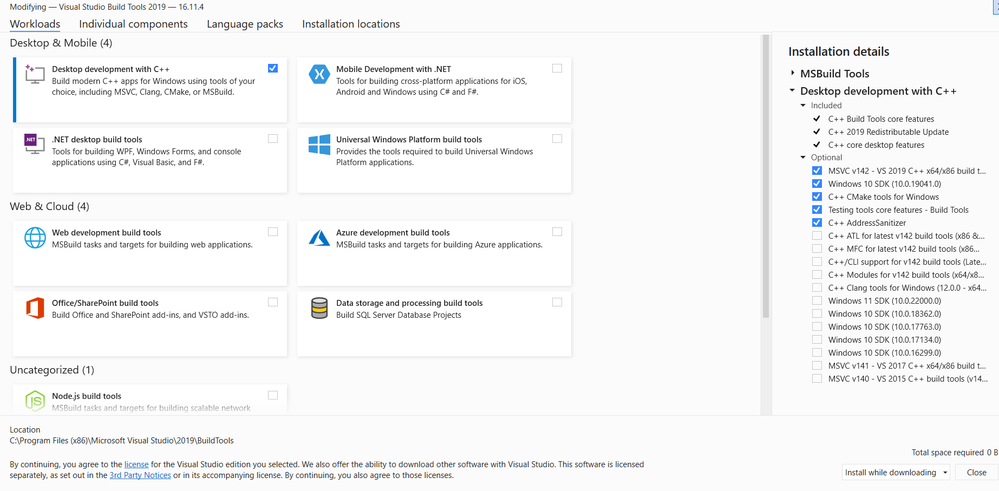

# Contributing guidelines

## Getting started

- If it is your first time working on this project, it is recommended to start working on issues labelled "First Timers Only".
- Choose an issue that is labelled "Available" and claim it in the comment section of the respective issue.
- Once the maintainer of the repository assigns it to you, you can start working on it.
- Make sure you keep updating us on your work.

## Setup 🛠️

### Step 1

- Fork this repository by clicking `fork button`

- Clone the repository in your local machine by typing

  ```sh
  git clone https://github.com/<your-username>/Cross-Platform-Activity-Tracker.git
  ```

  in your terminal(for _mac/linux_) or Git Bash (for _windows_)

- Now create a new branch using

  ```sh
  git checkout -b <your-new-branch-name>
  ```

### Step 2

- Install `nodejs` and `npm` on your local machine. For [windows](https://www.geeksforgeeks.org/installation-of-node-js-on-windows/), [linux](https://www.digitalocean.com/community/tutorials/how-to-install-node-js-on-ubuntu-20-04) and [mac](https://nodesource.com/blog/installing-nodejs-tutorial-mac-os-x/)

- Windows users need to install **Visual Studio Build Tools** with **Desktop development with C++** workload checked. (Please note that this is different from Visual Studio Code)
  [Download Visual Studio Build Tools](https://visualstudio.microsoft.com/thank-you-downloading-visual-studio/?sku=BuildTools).

  

- Mac users need to install `Xcode Command Line Tools` by running

  ```sh
  xcode-select –install
  ```

- Install `pnpm` by opening your terminal with administrative (sudo) privileges and type

  ```sh
  npm i -g pnpm
  ```

- Open your terminal in your current working directory (i.e, `Activity-Tracker`) and run the following command to install all dependencies for the project

  ```sh
  pnpm i
  ```

### Step 3

- Navigate to `Activity-Tracker` directory and type

  ```sh
  pnpm run dev
  ```

- If you get an error, type these commands

  ```sh
  pnpm dlx rimraf node_modules
  ```

  ```sh
  pnpm install
  ```

  Now start the application by running

  ```sh
  pnpm run dev
  ```

- Open http://localhost:3001/ in a browser and enter. At this address, the web application will be running

### Step 4 (Optional)

If you want to use MongoDB (instead of the default JSON storage), you can either:

- Download [MongoDB](https://www.mongodb.com/try/download/community) locally.
  Linux user can use these steps for [MongoDB](https://docs.mongodb.com/manual/tutorial/install-mongodb-on-ubuntu/) installation.

  OR

- Install wsl on your machine, only for [windows] (https://docs.microsoft.com/en-us/windows/wsl/install) and also download ubuntu from microsoft store.
  wsl and ubuntu installation is not required for windows 10 pro.

- Install docker on your machine. We are using docker container to run MongoDB so that it remains isolated from rest of the system and is easy to setup. For [windows](https://docs.docker.com/desktop/windows/install/), [linux](https://docs.docker.com/engine/install/ubuntu/) and [mac](https://docs.docker.com/desktop/mac/install/).

- Install `docker-compose` by following the [official guide](https://docs.docker.com/compose/install/).
  `docker-compose` is already installed when using docker desktop for Windows/macOS.

- Navigate to `Activity-Tracker` directory and with administrative privileges run

  ```sh
  docker-compose up -d
  ```

</br>

If you face any issues while setting up feel free to ask the moderators in [issues](https://github.com/OpenLake/Cross-Platform-Activity-Tracker/issues) and if you are new to open source refer to this [link](https://github.com/firstcontributions/first-contributions)

## Raising a PR

- You can find a step-by-step proceducre on how to create a PR [here](https://github.com/OpenLake/Cross-Platform-Activity-Tracker/wiki/A-step-by-step-procedure-for-creating-a-PR)
- While raising a pull request from your branch, please follow the [PR-name-style-guide](https://github.com/OpenLake/Cross-Platform-Activity-Tracker/wiki/PR-name-style-guide).
- While submitting your PR, please follow [this template](https://github.com/OpenLake/Cross-Platform-Activity-Tracker/blob/main/.github/PULL_REQUEST_TEMPLATE.md)
